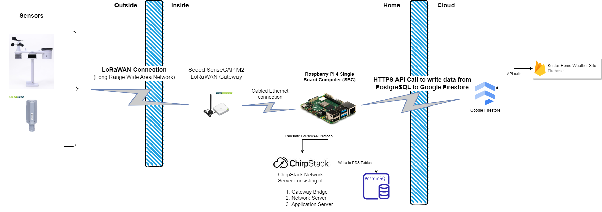

## Why

...Why not? 

Through this project the kids can learn basics of sensors in the real world, wireless networks, databases, and the power of cloud technologies. At the end, they will be able to point their friends and family from around the world to a website to see how hot it is, how much rain we've gotten, the air quality, etc. near their home. 

## High Level Diagram  

The diagram below show, at a high level, what we want to set up. Essentially, we want to have one SEEED sensor (to start), the 8-in-1 Weather sensor, that is connected to a computer inside the house and communicates over a Long Range Wide Area Network (LoRaWAN). The sensor will connect to a LoRaWAN gateway that will convert the wireless communication into a digital, computer readable format. That will then connect to a ChirpStack server on our local Raspberry Pi computer. This ChirpStack server will feed the data recieved from the sensor into a PostgreSQL Database stored on the Raspberry Pi. The Raspberry Pi will then push that data periodically to a Google Cloud Platform (GCP) managed database (likely PostgreSQL initially for ease of use). Finally, we will create a static web-page using Quarto and Observable JS, deployed to Google Firebase to query the GCP database and chart the results.

  